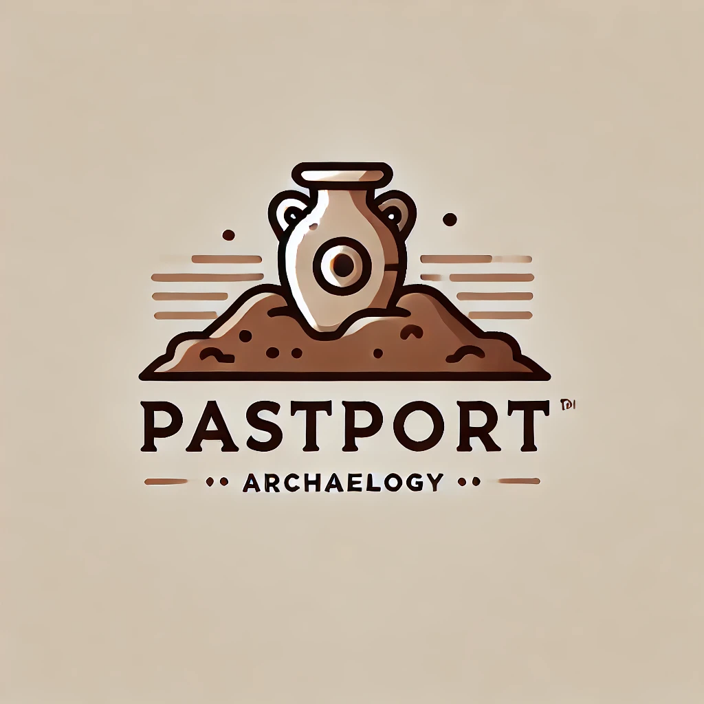

# PastPort 
*[Gladiator's theme song playing in the background...🎶]*

A centralised platform for storing and documenting archaeological sites and their artefacts

## Features
Artefact documentation at archaeologicla sites is a heavily manual process for the most part. Apart from being time consuming, this also means that most sites record their artefacts in isolation and with minimal knowledge of what is going on in other sites. PastPort aims to overcome these challenges by providing arhcaeologists with a platform where they can create new sites, add artefacts to existing sites, allow new members to join their site, and share their findings with other researchers; it's essentianlly the GitHub of archaeology if you may. Development is currently in progress, but below, you can see a list of features. The ones implemented have a green tick next to them (✅).
- New user signup ✅
- Existing user login ✅
- Users can create a new site ✅
- Users can request to join a site ✅
- Admins of a user can accept join requests
- Users can add new artefacts to a site if they are a member ✅
- Non-member users can view public artefatcs of a specific site
- Member users can view private artefacts of a site
- Sites can be loaded and viewed on a map
